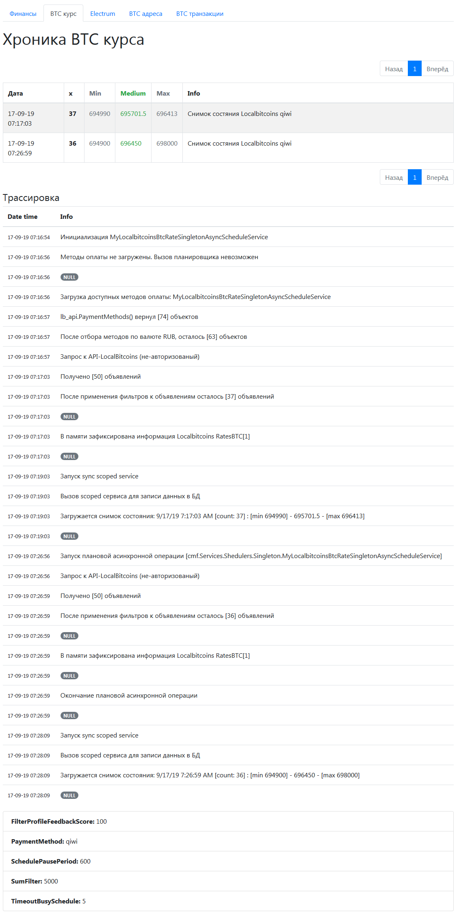

## Async Singleton Service - для определения акутального аргументированого курса BTC основываясь на [api данных биржи LocalBitcoins](https://localbitcoins.net/api-docs/)

Готовый асинхронный сервис для получения актуального (аргументированого) курса биткоина.

- используется официальный API биржи localbitcoins.net (публичная его часть) без использования api-auth-key или api-auth-secret
- в зависимости от настроек сервис анализирует нужный срез публичных данных биржи
- с каждой итерацией асинхронной операции - транзитные данны накапливаются в `public ConcurrentBag<BtcRateLocalbitcoinsModel> RatesBTC`
- максимальный размер хранимых данных ограничиваются параметром `MaxSizeTransit`
- хранимые объекты `BtcRateLocalbitcoinsModel` наследуются от `MetadataEntityModel.RootEntityModel` (=> кроме всег опрочего в нём определено свойство `public int Id { get; set; }` атрибутом `[DatabaseGenerated(DatabaseGeneratedOption.Identity)]`) и соответсвенно тип пригоден для определения таблицы базы данных `public DbSet<BtcRateLocalbitcoinsModel> BtcRatesLocalbitcoins { get; set; }`
- простота последующего извлечение данных и записи их в базу данных в scoped сервисе-адаптере
- позволяет иметь информацию о реальном курсе биткоина. Можно настроить сумму среднего чека и метода оплаты. Таким образом определяется реальный курс по которому можно прямо сейчас купить на данной бирже.

Настройки сервиса позволяют настроить частоту обновления курса и другие парамтры. Например можно указать сервису в разрезе какого метода оплаты требуется определение цены. Или по сумме чека.

DEMO пример визуализации работы сервиса по расписанию (1 раз в минуту обновлять курс)
